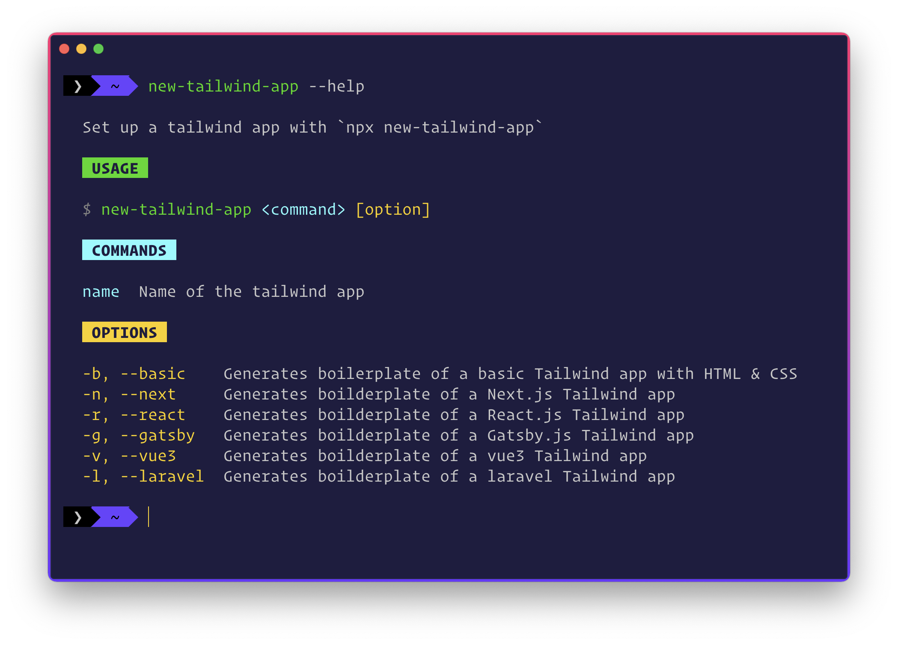

<div align="center">
	<h1>💥 new-tailwind-app</h1>
	
	
	
	
</div>
<br>

A cross-platform Node.js based CLI that generates boilerplate code for different **tailwind** web applications.

>Note: If you are on Windows, make sure to either use Command Prompt or Windows Powershell to run the CLI.

## 🎯 Features

- 💫 Generates **basic** tailwind app with HTML & CSS boilerplate code
- 📦 Generates **Next.js** tailwind app
- ⚡️ Generates **React.js** tailwind app
- 🎩 Generates **Gatsby.js** tailwind app
- 🚀 Generates **Vue3** tailwind app
- 💥 Generates **Laravel** tailwind app
- 💻 Integrated **Prettier** in Next.js, React.js, Gatsby.js & Vue3 to easily format the code with `npm run format`

## 📦 Installation

```sh
# install the CLI globally
npm install -g new-tailwind-app

# use it with npx (recommended)
npx new-tailwind-app [app_name] --flag
```

## 🚀 Usage

Navigate to the folder you want to have your tailwind web app.

```sh
# help section
npx new-tailwind-app --help

# create a basic tailwind app
npx new-tailwind-app [app_name] --basic

# create a next.js tailwind app
npx new-tailwind-app [app_name] --next

# create a react.js tailwind app
npx new-tailwind-app [app_name] --react

# create a gatsby.js tailwind app
npx new-tailwind-app [app_name] --gatsby

# create a vue3 tailwind app
npx new-tailwind-app [app_name] --vue3

# create a laravel tailwind app
npx new-tailwind-app [app_name] --laravel

# if installed globally
new-tailwind-app [app_name] --flag

```



## 🎩 Demo

```sh
# if you have installed globally
new-tailwind-app
```


```sh
# set up a basic tailwind app using npx
npx new-tailwind-app@latest [app_name] --basic
```


```sh
# sets up next.js tailwind app using npx
npx new-tailwind-app@latest [app_name] --react
```


## 👨🏻‍💻 Contributing

Make sure you read the [contributing guidelines](https://github.com/msaaddev/new-tailwind-app/blob/master/contributing.md) before opening a PR. If you want something else to **integrate** with the CLI, open an issue in the repository and I will get back to it.

## 🔑 License & Conduct

- MIT © [Saad Irfan](https://github.com/msaaddev)
- [Code of Conduct](https://github.com/msaaddev/new-tailwind-app/blob/master/code-of-conduct.md)
